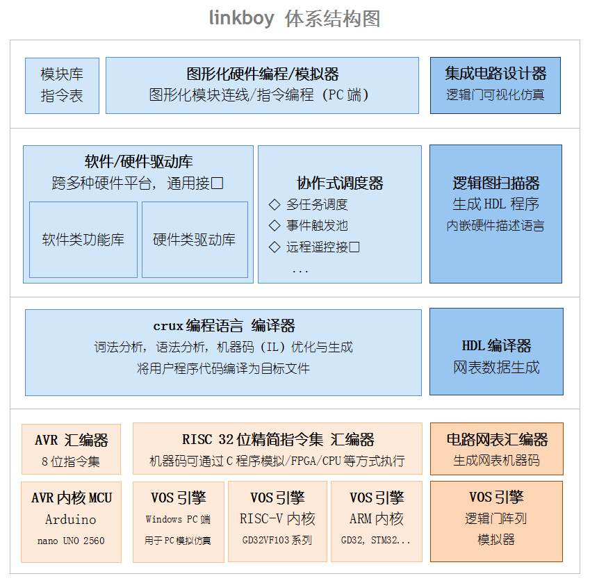
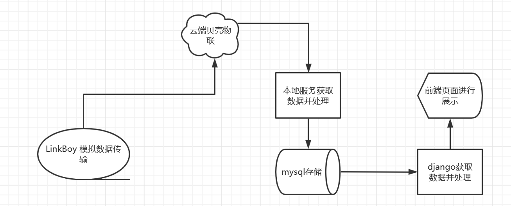

# industry_of_IOT

系统主要分为以下几个部分： 数据采集和控制模块的设计和实现、中转模块实现、后端服务器的实现，数据存储功能的实现及Web前端数据功能模块的实现。

 数据采集和控制模块通过linkboy来实现，中转模块通过贝壳物联来实现，后端服务器通过python来实现，web服务通过django及bootstrap实现。

### 2.1.1 linkboy介绍

linkboy体系的内核是一门自研的面向物联网/嵌入式的编程语言crux，其语法结构接近C语言，主要特点为面向嵌入式场景增强了安全机制，通过模拟仿真简化编程调试，提供编译运行和解释执行两种模式。 如图2.1 所示，体系结构分为嵌入式调度系统、图形化界面等。

### 2.1.2 贝壳物联介绍

贝壳物联是一个让你与智能设备沟通更方便的物联网云平台，你可以通过互联网以对话、遥控器等形式与你的智能设备聊天、发送指令，查看实时数据，跟实际需求设置报警条件，通过APP、邮件、短信、微博、微信等方式通知用户，通过此平台可以传递数据。

### 2.1.3 Django介绍

Django 是一个由 Python 编写的一个开放源代码的 Web 应用框架。使用 Django，只要很少的代码，Python 的程序开发人员就可以轻松地完成一个正式网站所需要的大部分内容，并进一步开发出全功能的 Web 服务 Django 本身基于 MVC 模型，即 Model（模型）、View（视图）及 Controller（控制器）设计模式，MVC 模式使后续对程序的修改和扩展简化，并且使程序某一部分的重复利用成为可能。

## 2.2 系统的总体设计目标和功能

基于云服务的工业物联网钢铁安全管理系统的系统总体设计目标如下所述：

1. 遵循稳定安全优先原则，做到云端本地双重备份数据，并且做到解耦合，防止系统崩溃。
2. 即时发出警报，通过邮件和弹窗两个渠道进行通知，防止信息的滞后。
3. 做到web服务的简单易用开发，充分考虑系统柔性能响应新变化，系统遵循统一开发规则，提高代码复用率。
4. 系统便于维护升级和功能扩展，采用成熟功能进行模块化设计，有效保证运行安全、稳定和可靠。

基于云服务的工业物联网钢铁安全管理系统的系统设计功能如下所述：

1. 实现传感器端使用linkboy模拟传感器数据。
2. 实现数据获取端使用python的requests库完成数据的获取并存储到mysql，使用邮件模块发送危险警告。
3. 实现web端使用django开发响应请求，使用bootstrap完成界面设计。

## 2.3 系统的总体框架和模块介绍

本系统的总体框架如图2.2 所示，完成了数据模拟、云端存取、web开发的功能，主要模块及功能在下文介绍。

（1）LinkBoy模拟数据模块：使用nano转UNO及ESP8266上传数据，使用传感器模拟真实数据。

（2）本地处理模块：使用Python的requests库通过HTTP协议获取数据，使用pymysql库存取数据，使用smtplib库发送邮件。

（3）web服务模块：使用Django作为后端处理服务模块，Bootstrap作为前端界面模块。